# 🎮 3LineMarker

> **"지도 위에 기록하는, 탐험 소셜 네트워크"**

레트로 게임 테마의 지도 기반 소셜 네트워크 서비스입니다.  
3줄의 텍스트로 장소를 기록하고, 지도 위에서 마커를 공유하며, 실시간으로 소통할 수 있습니다.


<p align="center">
  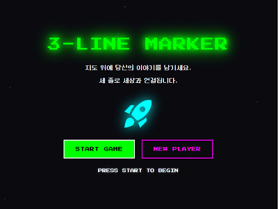
  
</p>

---

## 💡 프로젝트 소개

**3LineMarker**는 지도 기반으로 장소를 기록하고 공유하는 소셜 네트워크 서비스입니다.

### 핵심 컨셉

- **지도 기반 시각화**: Leaflet 지도를 활용한 직관적인 장소 공유
- **3줄 텍스트**: 간결하고 감성적인 정보 전달 방식
- **레트로 게임 테마**: 네온 색상과 픽셀 폰트로 독특한 사용자 경험
- **실시간 소통**: WebSocket 기반 일대일 채팅으로 즉각적인 커뮤니케이션

---

## 🎯 프로젝트 특징

### 기술적 특징

| 특징                        | 설명                                                      |
| --------------------------- | --------------------------------------------------------- |
| **지도 기반 아키텍처**      | Leaflet 지도 라이브러리를 활용한 인터랙티브한 마커 시스템 |
| **Redux Toolkit 상태 관리** | 전역 상태를 효율적으로 관리하여 일관된 사용자 경험 제공   |
| **JWT + bcrypt 보안**       | 토큰 기반 인증과 비밀번호 해싱으로 안전한 사용자 인증     |
| **WebSocket 실시간 통신**   | Socket.io를 활용한 실시간 채팅 및 알림 시스템             |
| **서버 사이드 필터링**      | 효율적인 데이터 처리와 성능 최적화                        |

### 사용자 경험 특징

- **레트로 게임 테마**: 네온 색상(녹색, 청록색, 마젠타)과 픽셀 폰트로 독특한 분위기
- **직관적인 인터페이스**: 지도 클릭으로 간편한 마커 생성
- **실시간 상호작용**: 좋아요, 댓글, 채팅이 즉시 반영되는 반응형 UI
- **개인화된 콘텐츠**: 카테고리 필터링과 검색으로 원하는 정보만 탐색

---

## ⏱️ 개발 기간

**2025.11.25 ~ 2025.12.02 (8일)**

---

## 🛠 사용 기술

### Frontend

| 기술명                                                                                              | 설명                                                       |
| --------------------------------------------------------------------------------------------------- | ---------------------------------------------------------- |
|                       | React 19.2.0 - 최신 React 기능을 활용한 컴포넌트 기반 개발 |
|            | Material-UI 7.3.5 - 일관된 UI 컴포넌트 라이브러리          |
|               | Redux Toolkit 2.11.0 - 효율적인 전역 상태 관리             |
|  | React Router 7.9.6 - 클라이언트 사이드 라우팅              |
|                 | Leaflet 1.9.4 - 오픈소스 지도 라이브러리                   |
|    | React-Leaflet 5.0.0 - React용 Leaflet 래퍼                 |
|   | Socket.io-client 4.8.1 - WebSocket 클라이언트              |

### Backend

| 기술명                                                                                     | 설명                                          |
| ------------------------------------------------------------------------------------------ | --------------------------------------------- |
|        | Node.js - 비동기 이벤트 기반 서버 런타임      |
|        | Express 5.1.0 - 간결한 웹 프레임워크          |
|              | MySQL 8.0 - 관계형 데이터베이스               |
|  | Socket.io 4.8.1 - WebSocket 서버              |
|          | JWT 9.0.2 - 토큰 기반 인증                    |
|           | bcrypt 6.0.0 - 비밀번호 해싱 (saltRounds: 10) |
|           | Multer 2.0.2 - 파일 업로드 처리               |
|              | Axios 1.13.2 - HTTP 클라이언트                |

### 외부 API

| 기술명                                                                                                    | 설명                                |
| --------------------------------------------------------------------------------------------------------- | ----------------------------------- |
|  | OpenWeatherMap API - 날씨 정보 제공 |

---

## 📄 주요 기능

### 🗺 지도 기반 마커 시스템

- **Leaflet 지도 통합**: 인터랙티브한 지도 인터페이스
- **지도 클릭으로 마커 생성**: 직관적인 사용자 경험
- **마커 CRUD**: 생성, 조회, 수정, 삭제 기능
- **카테고리별 필터링**: 음식점, 카페, 관광지, 쇼핑, 기타
- **마커 클러스터링**: 많은 마커의 성능 최적화
- **이미지 업로드**: Multer를 활용한 파일 업로드 및 미리보기

<details>
<summary>📸 스크린샷 보기</summary>

#### 지도 페이지

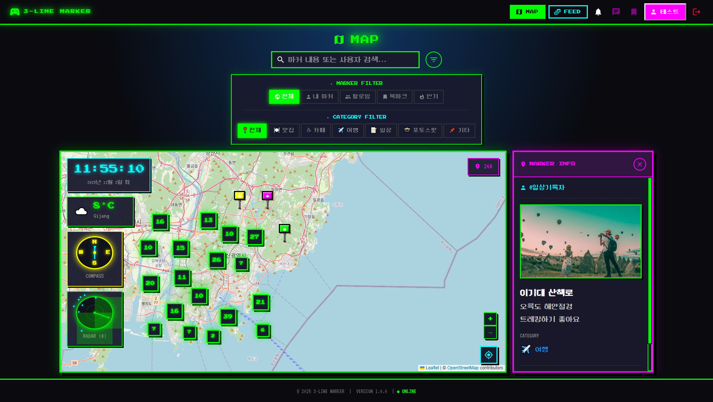

#### 마커 상세 정보 & 검색 기능

<p align="center">
  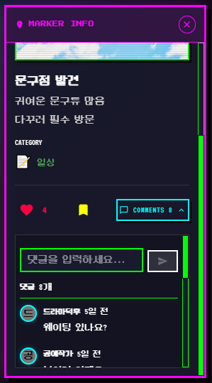&nbsp;&nbsp;&nbsp;&nbsp;
  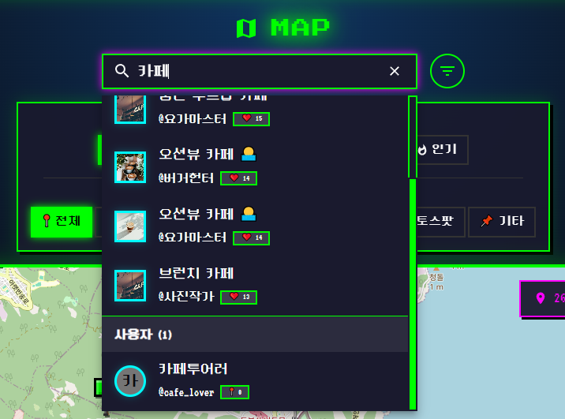
</p>

</details>

### 👥 사용자 인증 및 프로필

- **JWT 토큰 기반 인증**: 안전한 사용자 인증 시스템
- **bcrypt 비밀번호 해싱**: 보안 강화
- **회원가입/로그인**: 아이디 중복 체크 포함
- **프로필 관리**: 닉네임, 상태 메시지, 프로필 이미지 수정
- **팔로우 시스템**: 팔로우/언팔로우 및 팔로워/팔로잉 목록

<details>
<summary>📸 스크린샷 보기</summary>

#### 로그인 & 회원가입

<p align="center">
  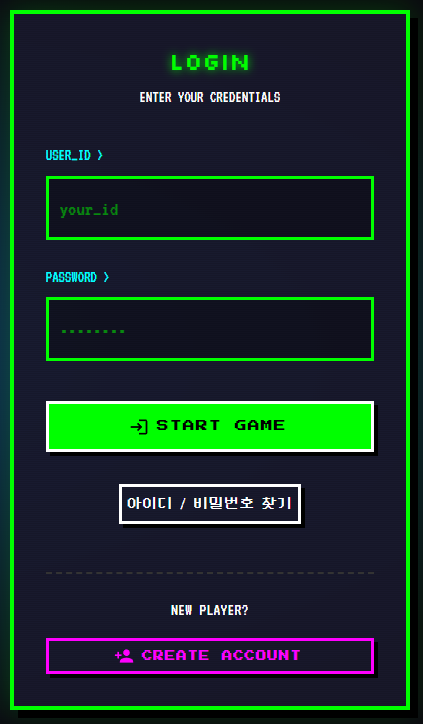&nbsp;&nbsp;&nbsp;&nbsp;
  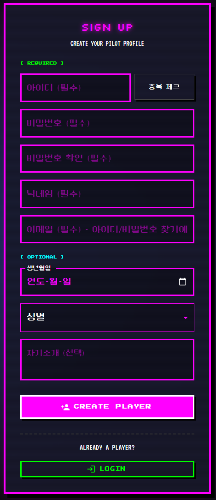
</p>

#### 아이디 찾기 & 비밀번호 찾기

<p align="center">
  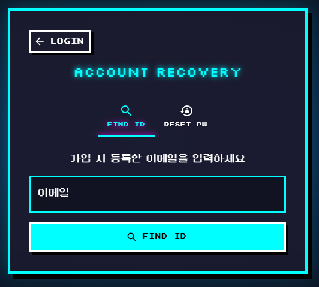&nbsp;&nbsp;&nbsp;&nbsp;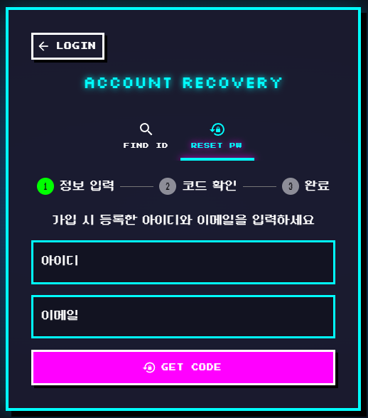
</p>

#### 팔로우 모달 & 프로필 페이지

<p align="center">
  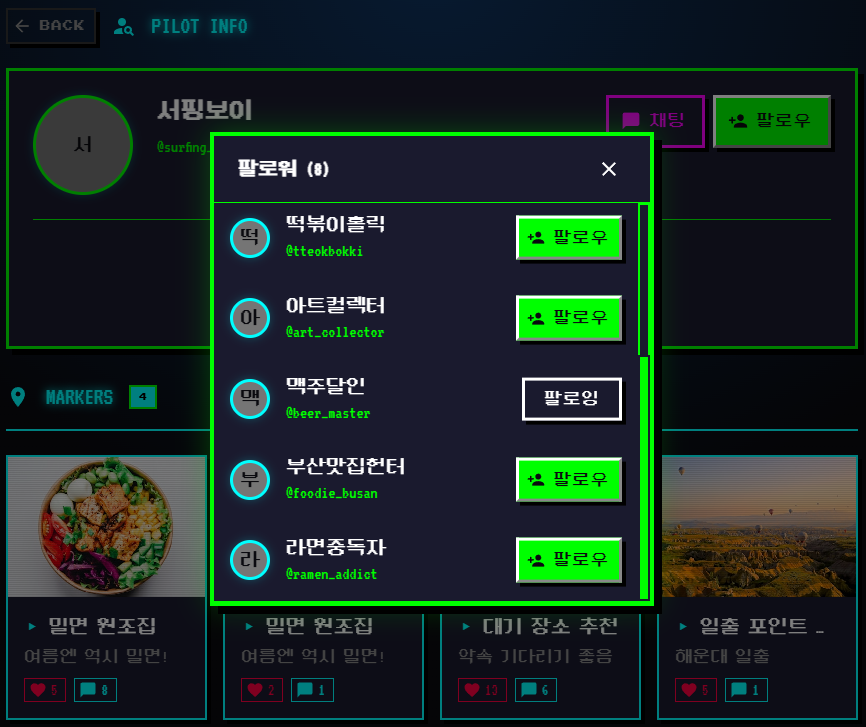&nbsp;&nbsp;&nbsp;&nbsp;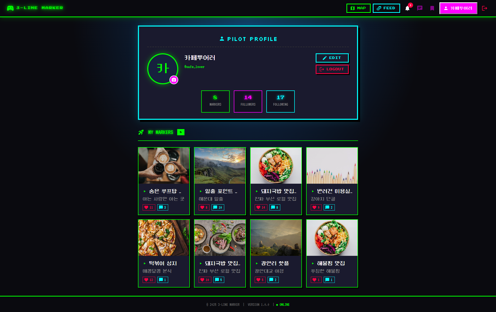
</p>

</details>

### 💬 소셜 기능

- **좋아요 시스템**: Optimistic UI 업데이트로 즉각적인 반응
- **댓글 기능**: 무한 스크롤을 통한 효율적인 댓글 관리
- **북마크 기능**: 관심 있는 마커 저장 및 관리
- **피드 시스템**: 무한 스크롤 / 팔로잉 피드와 탐색 피드 (최신순/인기순 정렬)
- **검색 기능**: 마커 및 사용자 검색 (디바운싱 적용)

<details>
<summary>📸 스크린샷 보기</summary>

#### 피드 페이지 & 북마크 페이지

<p align="center">
  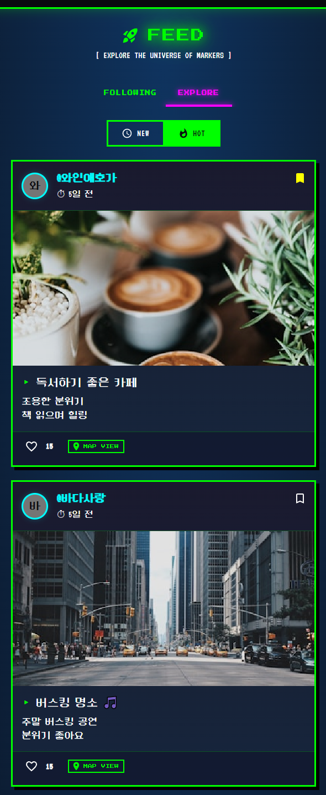&nbsp;&nbsp;&nbsp;&nbsp;
  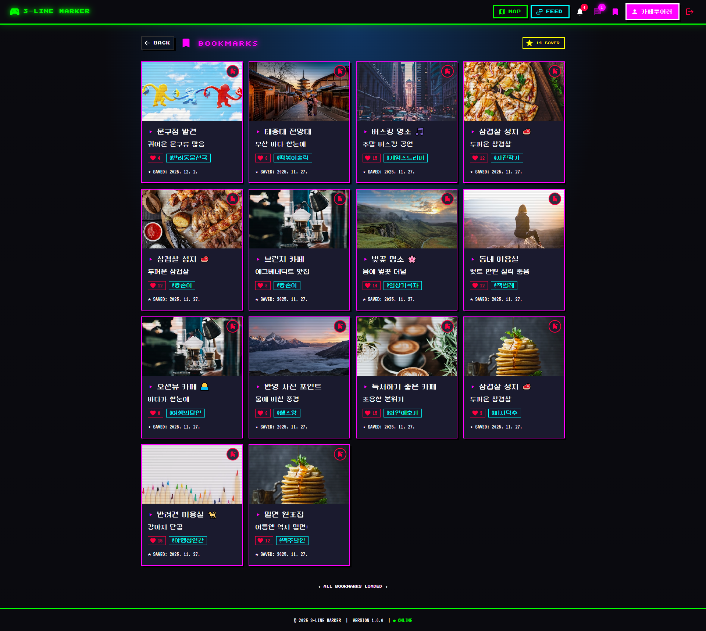
</p>

</details>

### 💬 실시간 채팅

- **WebSocket 기반 통신**: Socket.io를 활용한 실시간 메시지 전송/수신
- **일대일 채팅**: 사용자 간 실시간 소통
- **채팅방 관리**: 채팅방 목록 및 메시지 읽음 처리
- **채팅 알림**: 실시간 알림 배지 표시

<details>
<summary>📸 스크린샷 보기</summary>

#### 채팅 페이지

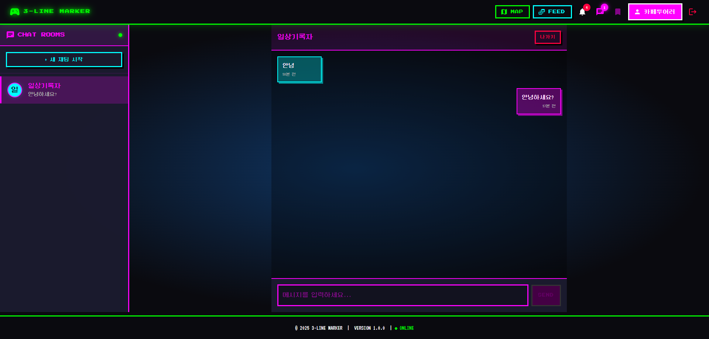

</details>

### 🔔 알림 시스템

- **다양한 알림 타입**: 좋아요, 댓글, 팔로우, 채팅 알림
- **실시간 알림 업데이트**: 30초 간격 폴링
- **알림 배지**: 헤더에 읽지 않은 알림 수 표시

<details>
<summary>📸 스크린샷 보기</summary>

#### 알림 목록

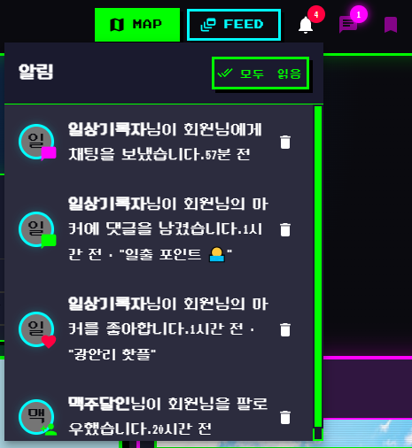

</details>

### 🎨 지도 위젯

- **시계 위젯**: 현재 시간 및 날짜 표시
- **날씨 위젯**: OpenWeatherMap API 연동
- **나침반 위젯**: 지도 방향 표시
- **레이더 위젯**: 주변 마커를 레이더 형태로 표시

---

## 🎨 UI/UX 특징

### 레트로 게임 테마

- **네온 색상**: 녹색(#00ff00), 청록색(#00ffff), 마젠타(#ff00ff)
- **픽셀 폰트**: Press Start 2P, VT323, DungGeunMo
- **레트로 다이얼로그**: 게임 스타일의 확인/취소 다이얼로그
- **별 배경 애니메이션**: 반짝이는 별 효과로 분위기 연출

### 반응형 디자인

- **모바일/태블릿/데스크톱**: CSS Grid와 Flexbox를 활용한 반응형 레이아웃
- **Material-UI 컴포넌트**: 일관된 디자인 시스템

---

## 🚀 시작하기

### 필수 요구사항

- Node.js (v18 이상)
- MySQL (v8.0 이상)

### 설치 및 실행

```bash
# 저장소 클론
git clone https://github.com/your-username/3LineMarker.git
cd 3LineMarker

# Backend 설정
cd backend
npm install
# .env 파일 생성 및 설정 (아래 참고)

# Frontend 설정
cd ../frontend
npm install
# .env 파일 생성 및 설정

# 데이터베이스 설정
# MySQL 데이터베이스 생성 후 migrations 폴더의 SQL 파일 실행

# 서버 실행
# Backend (포트 3010)
cd backend
npm start

# Frontend (포트 3000)
cd frontend
npm start
```

### 환경 변수 설정

**backend/.env**

```env
PORT=3010
DB_HOST=localhost
DB_USER=root
DB_PASSWORD=your_password
DB_NAME=3linemarker
JWT_SECRET=your_jwt_secret_key
FRONTEND_ORIGIN=http://localhost:3000
OPENWEATHER_API_KEY=your_openweather_api_key
```

**frontend/.env**

```env
REACT_APP_API_BASE_URL=http://localhost:3010
```

---

## 📁 프로젝트 구조

```
3LineMarker/
├── backend/          # Backend 서버
│   ├── src/
│   │   ├── config/   # 설정 파일 (데이터베이스, JWT)
│   │   ├── controllers/  # 컨트롤러
│   │   ├── routes/   # 라우터
│   │   └── utils/    # 유틸리티
│   └── migrations/   # DB 마이그레이션
├── frontend/         # Frontend 클라이언트
│   └── src/
│       ├── components/  # 컴포넌트
│       ├── pages/    # 페이지
│       └── utils/    # 유틸리티
└── docs/            # 문서
```

---

## ✨ 주요 기능 요약

| 기능           | 기술적 특징                                    |
| -------------- | ---------------------------------------------- |
| 지도 기반 마커 | Leaflet 지도 라이브러리, 마커 클러스터링       |
| 실시간 채팅    | WebSocket (Socket.io), 일대일 채팅             |
| 소셜 기능      | Optimistic UI, 무한 스크롤, 서버 사이드 필터링 |
| 알림 시스템    | 실시간 폴링, JWT 인증 기반                     |
| 피드 시스템    | Redux Toolkit 상태 관리, 페이지네이션          |
| 검색 기능      | 디바운싱, 서버 사이드 검색                     |
| 사용자 인증    | JWT 토큰, bcrypt 해싱                          |
| 지도 위젯      | OpenWeatherMap API, 실시간 업데이트            |

---

## 📚 상세 문서

- [API 문서](./docs/API.md) - API 엔드포인트 상세 설명
- [개발일지](./docs/DAY1_개발일지.md) - 일자별 개발 과정
- [포트폴리오 요약본](./docs/포트폴리오_요약본.md) - 프로젝트 핵심 요약

---

## 🎯 프로젝트 성과

- ✅ 목표한 핵심 기능 100% 구현
- ✅ ESLint 경고 0개
- ✅ 실시간 채팅 시스템 구축 (WebSocket)
- ✅ 레트로 테마 UI/UX 완성
- ✅ JWT + bcrypt 보안 구현
- ✅ Redux Toolkit을 통한 효율적인 상태 관리

---

## 💡 배운 점

- **React Hooks 최적화**: useCallback, useMemo, useRef의 적절한 활용으로 성능 최적화
- **실시간 통신**: WebSocket을 활용한 실시간 기능 구현 및 이벤트 기반 아키텍처 이해
- **상태 관리**: Redux Toolkit을 통한 전역 상태 관리 및 로컬/전역 상태 구분
- **보안**: JWT 토큰 기반 인증과 bcrypt를 통한 비밀번호 해싱
- **성능 최적화**: 불필요한 리렌더링 방지 및 메모이제이션 전략

---

## 📝 라이선스

이 프로젝트는 개인 프로젝트입니다.

---

**개발 기간**: 2025년 11월 25일 ~ 12월 02일  
**버전**: 1.0.0
